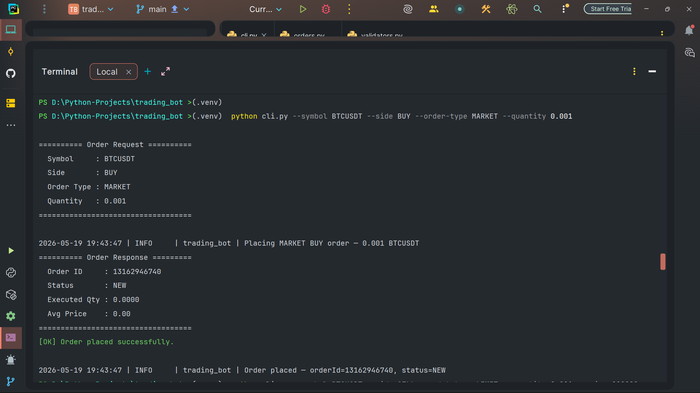
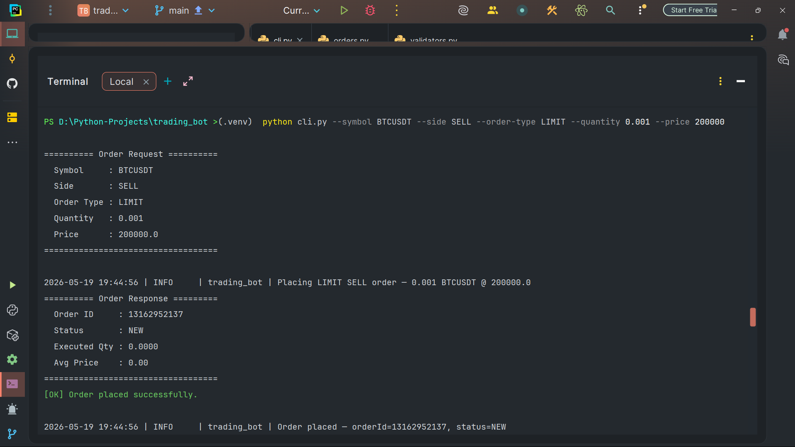
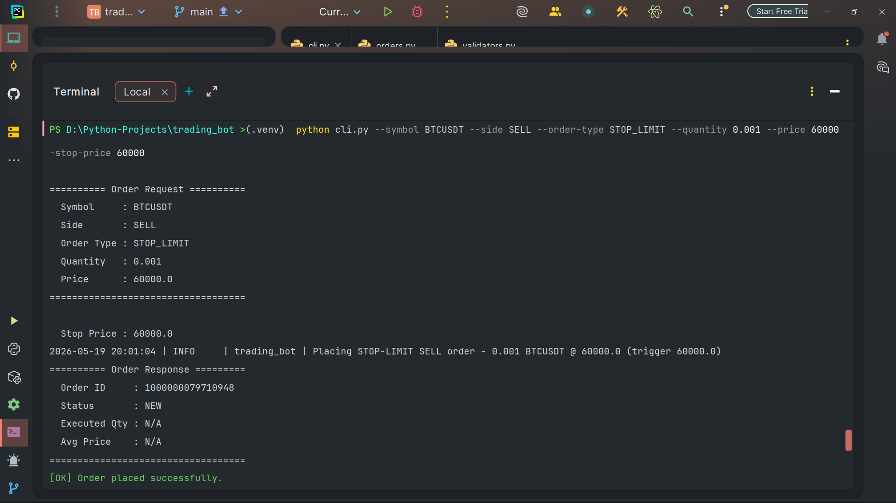
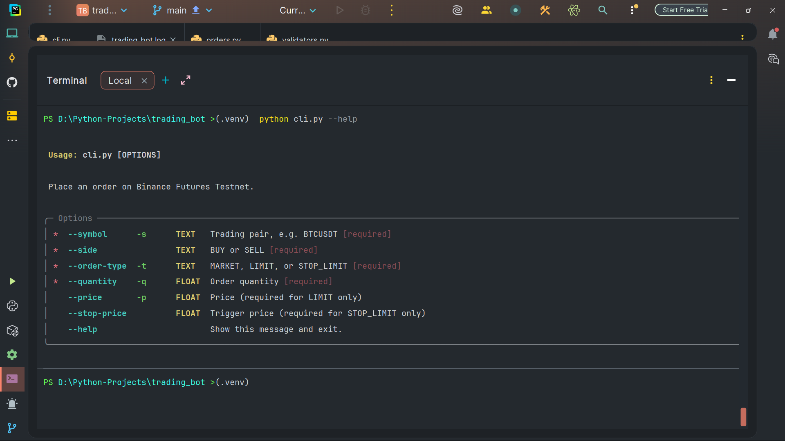
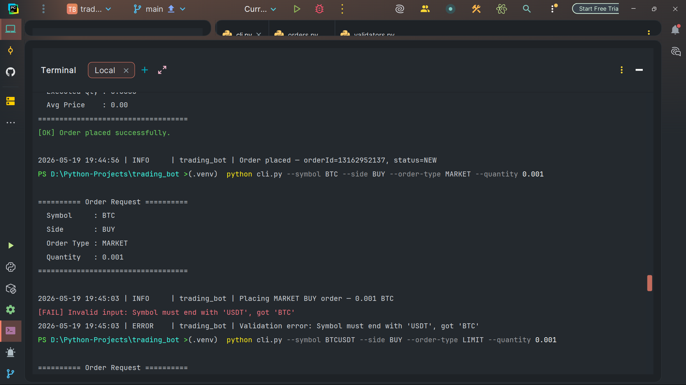
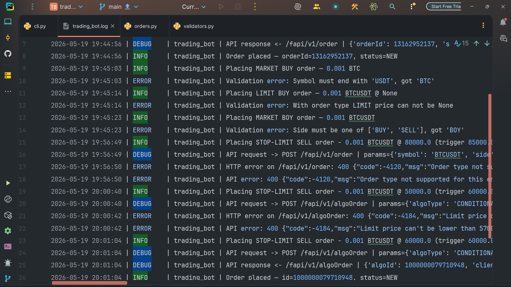
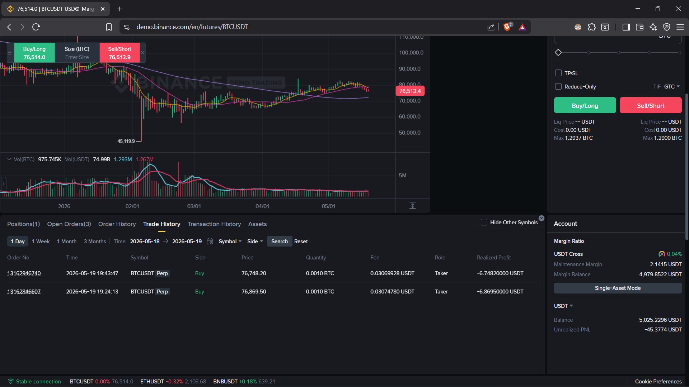

# 📈 Binance Futures Testnet Trading Bot

> A clean, production-quality CLI for placing **MARKET**, **LIMIT**, and **STOP-LIMIT** orders on Binance USDⓈ-M Futures Testnet — with proper validation, structured logging, and graceful error handling.


---

## 🎯 Overview

A simplified trading bot built in **Python 3.10+** that places orders on the **Binance Futures Testnet** via the official REST API. It demonstrates:

- Clean separation of concerns (CLI ↔ orders ↔ validators ↔ client)
- Fail-fast input validation **before** any network call
- HMAC-SHA256 request signing on a reusable `requests.Session`
- Structured logging to **file (full audit trail) + console (summary only)**
- Layered exception handling with shell-friendly exit codes

Built with **direct REST calls** (no `python-binance` wrapper) so every step — signing, parameter assembly, response parsing — is transparent and easy to debug.

---

## ✨ Features

- ✅ **Three order types** — MARKET, LIMIT, and STOP-LIMIT (bonus)
- ✅ **Both sides** — BUY and SELL
- ✅ **Strict validation** — every input checked before touching the network
- ✅ **Audit-grade logging** — `logs/trading_bot.log` captures full request/response details
- ✅ **Polished CLI** — Typer-powered, with a clean `--help`, did-you-mean typo suggestions, and colored output
- ✅ **Shell-friendly exit codes** — `1=validation, 2=API error, 3=network, 99=unknown`
- ✅ **No secrets in logs** — HMAC signatures are stripped before write
- ✅ **Works on the new Algo Order API** — handles the December 2025 Binance migration for conditional orders

---

## 🆕 Note on the Binance Algo Order Migration

As of **2025-12-09**, Binance migrated all conditional order types (`STOP`, `STOP_MARKET`, `TAKE_PROFIT`, `TAKE_PROFIT_MARKET`, `TRAILING_STOP_MARKET`) from `/fapi/v1/order` to the new **`/fapi/v1/algoOrder`** endpoint. Submitting these to the old endpoint now returns error `-4120` (`STOP_ORDER_SWITCH_ALGO`).

This bot's `STOP_LIMIT` implementation targets the new endpoint and handles:
- The required `algoType=CONDITIONAL` parameter
- The renamed field `stopPrice` → `triggerPrice`
- The renamed response fields `orderId` → `algoId` and `status` → `algoStatus`

📚 [Source: Binance Derivatives Change Log](https://developers.binance.com/docs/derivatives/change-log)

---

## 🛠️ Tech Stack

| Component | Choice | Why |
|---|---|---|
| Language | **Python 3.10+** | Uses `str \| None` union syntax |
| HTTP client | **`requests`** | Battle-tested, transparent, easy to debug |
| CLI framework | **Typer** | Auto-generated help, type-safe options, polished UX |
| Env management | **`python-dotenv`** | Standard secret loading from `.env` |
| Logging | **stdlib `logging`** | Multi-handler setup, no extra dependency |

---

## 🗂️ Project Structure

```text
trading_bot/
├── bot/
│   ├── __init__.py
│   ├── client.py          # Signed REST client (HMAC-SHA256, requests.Session)
│   ├── orders.py          # Order placement logic (market / limit / stop-limit)
│   ├── validators.py      # Input validation (fail-fast with clear errors)
│   └── logging_config.py  # Logger setup (file DEBUG+, console INFO+)
├── logs/
│   └── trading_bot.log    # Audit trail
├── docs/
│   └── screenshots/       # Demo screenshots referenced in this README
├── cli.py                 # CLI entry point (Typer)
├── .env                   # API credentials — gitignored
├── .gitignore
├── requirements.txt
└── README.md
```

---

## ⚙️ Prerequisites

1. **Binance Futures Testnet account** — register at <https://testnet.binancefuture.com>
2. **API credentials** — generate API Key + Secret from the testnet dashboard (System Generated, HMAC)
3. **Python 3.10 or newer**

---

## 🚀 Setup

```bash
# 1. Clone the repo
git clone https://github.com/Manglam11/binance-futures-testnet-bot.git
cd binance-futures-testnet-bot

# 2. Create and activate a virtual environment
python -m venv .venv

#   Windows (PowerShell):
.\.venv\Scripts\Activate.ps1
#   macOS / Linux:
source .venv/bin/activate

# 3. Install dependencies
pip install -r requirements.txt
```

---

## 🔐 Configuration

Create a `.env` file in the project root (this file is gitignored):

```env
BINANCE_API_KEY=your_testnet_api_key_here
BINANCE_API_SECRET=your_testnet_api_secret_here
BINANCE_BASE_URL=https://testnet.binancefuture.com
```

> ⚠️ Never commit your `.env` file. The included `.gitignore` excludes it by default.

---

## 📖 Usage

### 1️⃣ MARKET order — executes immediately at current price

```bash
python cli.py --symbol BTCUSDT --side BUY --order-type MARKET --quantity 0.001
```



### 2️⃣ LIMIT order — executes only when market reaches your price

```bash
python cli.py --symbol BTCUSDT --side SELL --order-type LIMIT --quantity 0.001 --price 200000
```



### 3️⃣ STOP-LIMIT order (BONUS) — triggers a LIMIT order when stop price is hit

```bash
python cli.py --symbol BTCUSDT --side SELL --order-type STOP_LIMIT --quantity 0.001 --price 60000 --stop-price 60000
```

> 💡 For a SELL stop-limit, the trigger price should be **below current market** (stop-loss).
> For a BUY stop-limit, the trigger price should be **above current market** (breakout).



### 🆘 View built-in help

```bash
python cli.py --help
```



---

## 📋 Command-line Options

| Option | Short | Required | Description |
|---|---|---|---|
| `--symbol` | `-s` | ✅ | Trading pair, e.g. `BTCUSDT` |
| `--side` | — | ✅ | `BUY` or `SELL` |
| `--order-type` | `-t` | ✅ | `MARKET`, `LIMIT`, or `STOP_LIMIT` |
| `--quantity` | `-q` | ✅ | Order quantity (positive float) |
| `--price` | `-p` | ⚠️ Conditional | Required for `LIMIT` and `STOP_LIMIT` |
| `--stop-price` | — | ⚠️ Conditional | Trigger price — required for `STOP_LIMIT` only |

---

## ✅ Validation Rules

All checks happen **before** any network call. Invalid input never reaches Binance.

| Input | Rule |
|---|---|
| `symbol` | Non-empty, ends with `USDT`, auto-uppercased |
| `side` | Must be `BUY` or `SELL` (case-insensitive) |
| `order_type` | Must be `MARKET`, `LIMIT`, or `STOP_LIMIT` |
| `quantity` | Numeric, strictly positive |
| `price` | Required for `LIMIT` / `STOP_LIMIT`; must be positive; **must be `None` for `MARKET`** |
| `stop_price` | Required for `STOP_LIMIT`; must be positive |

Each failure raises a `ValueError` with a human-readable message:



---

## 📝 Logging

Two log destinations, configured in `bot/logging_config.py`:

| Destination | Level | Content |
|---|---|---|
| `logs/trading_bot.log` | `DEBUG` and up | Full request/response/error audit trail (UTF-8 encoded) |
| Terminal (stderr) | `INFO` and up | High-signal summary only |

**Sensitive data — HMAC signatures — are stripped from log entries before write.**

Sample log file:



Reference logs (1 MARKET, 1 LIMIT, 1 STOP_LIMIT, validation errors) are included in `logs/trading_bot.log`.

---

## 🚨 Error Handling

| Error type | Exit code | Behavior |
|---|---|---|
| Validation (`ValueError`) | `1` | Caught before any network call; clear message |
| Binance API (`requests.HTTPError`) | `2` | Status code + response body logged |
| Network (`requests.RequestException`) | `3` | Timeouts, DNS failures, connection errors |
| Unexpected | `99` | Full stack trace logged via `logger.exception` |

Exit codes make the bot **shell-script friendly** — you can chain it (`&&`, `||`) reliably.

---

## 🔬 Tested Scenarios

| # | Scenario | Expected |
|---|---|---|
| 1 | MARKET BUY 0.001 BTCUSDT | ✅ Order accepted, `status=NEW` |
| 2 | LIMIT SELL 0.001 @ 200000 | ✅ Order accepted, sits open |
| 3 | STOP_LIMIT SELL 0.001 @ 60000 (trigger 60000) | ✅ Algo order accepted, `algoStatus=NEW` |
| 4 | Symbol `BTC` (no `USDT` suffix) | ❌ Rejected by validator |
| 5 | LIMIT without `--price` | ❌ Rejected by validator |
| 6 | Side `BOY` | ❌ Rejected by validator |

Proof — all three order types visible in the Binance Testnet UI:



---

## 📌 Assumptions

- Trading exclusively on **USDⓈ-M Futures Testnet** (`https://testnet.binancefuture.com`) — no mainnet support.
- All trading pairs **must end with `USDT`**.
- Account is in **One-way Mode** (`positionSide: BOTH`); Hedge Mode is **not** supported.
- All LIMIT and STOP_LIMIT orders use `timeInForce: GTC` (Good Till Cancelled).
- STOP_LIMIT routes through the **new Algo Order endpoint** (`/fapi/v1/algoOrder`) per the December 2025 API migration.
- Network timeout per request is **10 seconds**.

---

## 🛣️ Future Improvements

- Add `STOP_MARKET`, `TAKE_PROFIT`, `TAKE_PROFIT_MARKET`, and `TRAILING_STOP_MARKET` order types (same algo endpoint)
- Add a "cancel order" command for both regular and algo orders
- Add a position-listing command (`GET /fapi/v2/positionRisk`)
- Add unit tests with `pytest` + `responses` (mock the API layer)
- Add a `--dry-run` flag that logs the payload without sending
- Build a Streamlit dashboard on top of the same `bot/` layer (zero refactor required thanks to separation of concerns)

---

## 👤 Author

**Manglam**

[](https://github.com/Manglam11)
[](https://www.linkedin.com/in/manglam-dubey/)

---

## 📜 License

Released under the [MIT License](LICENSE).

---

[](https://testnet.binancefuture.com)
[](https://developers.binance.com/docs/derivatives/usds-margined-futures)

---

> *"Risk comes from not knowing what you're doing."* — **Warren Buffett**